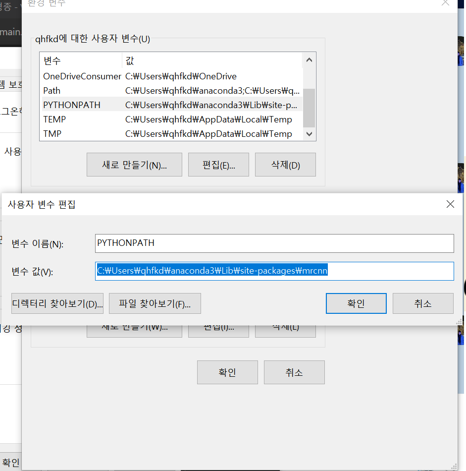

### mrcnn 모듈 다운
1. git clone https://github.com/matterport/Mask_RCNN.git
2. cd Mask_RCNN
python setup.py install
3. 설치확인
> pip show mask-rcnn
### mrcnn 파이썬 라이브러리 경로에 추가
> 1. 시스템 환경변수 편집
>> * 새로만들기 버튼 클릭
>> * PYTHONPATH 이름으로 만들고
>> * 경로는 "C:\Users\qhfkd\anaconda3\Lib\site-packages\mrcnn"
이런 형태로 삽입( 즉 mrcnn이 들어있는 폴더 삽입)

### mrcnn 모듈 불러오기
> from mrcnn.utils import Dataset
해보기